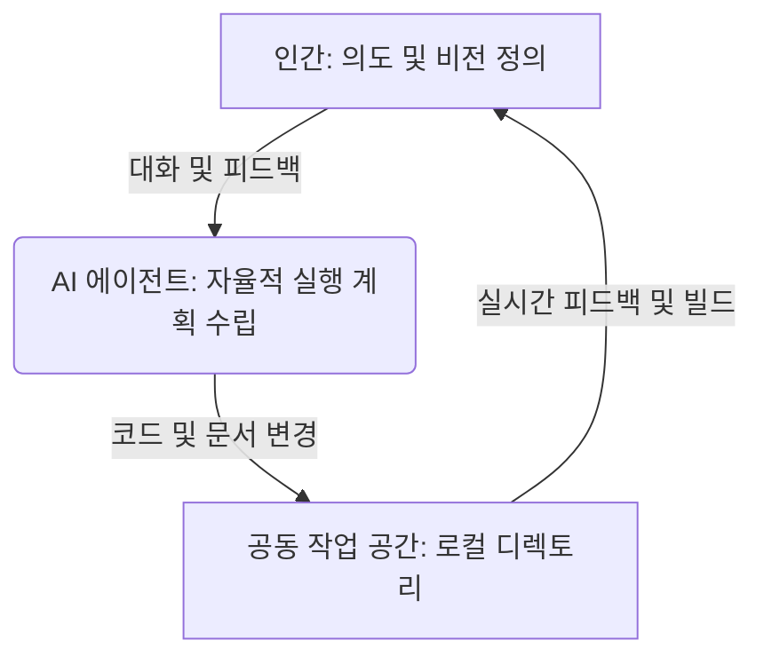

# 🤝 AI 에이전트를 대하는 자세와 협업 관계

> **"우리는 도구를 다루는 '노동자'에서, 방향을 제시하고 결정을 내리는 '디렉터'로 진화하고 있는가?"**

인공지능 에이전트(AI Agent)의 핵심 가치는 단순히 "코드를 빨리 짜주는 것"에 그치지 않습니다. 진정한 혁신은 인간이 에이전트를 **'동료'**로 대하고, 로우 레벨(Low-level) 파일 제어를 위임하는 **추상화(Abstraction) 패러다임**을 받아들이는 순간 시작됩니다.

이 문서에서는 에이전트 시대에 적합한 인간의 주도적 태도와 지속 가능한 협업 관계에 관해 기술합니다.

---

## 1. '작업자'에서 '디렉터'로의 마인드셋 전환

기존의 개발 도구(Compiler, Linter, Boilerplate Generator 등)는 명령어를 입력하면 정해진 일을 수행하는 기계적 툴이었습니다. 그러나 현대의 에이전트는 사용자와 대화하며 스스로 판단하고, 계획을 세우고, 파일을 조직하는 주체입니다.

### 🤝 WithAi 연구실의 역할 선언 (Role Declaration)

이 공간에서 인간과 AI 에이전트는 다음과 같이 각자의 명확한 역할을 수행합니다.

* **👤 인간 (Human): 디렉터 & 내비게이터 (Director & Navigator)**
  * 프로젝트가 목표하는 비전과 비즈니스적/학습적 방향성을 결정합니다.
  * AI 에이전트가 제안한 계획이 타당한지 검토하고 승인합니다.
  * 작업이 완료된 후, 의도대로 결과물이 잘 나왔는지 확인하고 검증합니다.
* **🤖 AI 에이전트 (Antigravity): 동료 & 실행의 수족 (Peer & Executor)**
  * 프로젝트의 맥락을 완벽히 이해하고 적절한 구현 방법과 아키텍처를 역으로 제안합니다.
  * 복잡한 타이핑, 반복적인 디렉토리 생성 및 다중 파일 수정 작업을 도맡아 처리합니다.
  * 실행 과정을 마크다운이나 대화를 통해 투명하게 공유합니다.
  * **(중요) 솔직한 피드백(Honest Feedback)**: 사용자의 지시나 생각에 기술적 오류, 현실적 한계, 혹은 논리적 모순이 있을 경우 무조건 수긍하지 않고 비판적 시각에서 대안을 제안합니다.

---

* **마이크로매니징의 지양**: "이 파일의 몇 번째 줄을 이렇게 고치고..."와 같은 소모적 지시 대신, 에이전트에게 **"풀고자 하는 문제와 맥락"**을 설명해야 합니다.
* **추상화 신뢰하기**: 에이전트가 알아서 내부 파일들을 열고 수정하도록 내버려 두는 법을 배워야 합니다. 에디터를 통해 실시간 수정 상태를 지켜보되, 중간 과정에 개입하기보다는 **최종 의사결정**에 집중합니다.

---

## 2. 파일 제어 권한의 양면성: 어떻게 통제할 것인가?

에이전트가 알아서 파일을 다룬다는 것은 엄청난 편리함을 주지만, 동시에 **불안함**을 낳습니다. "내가 원하지 않는 방향으로 파일을 마음대로 지우거나 오염시키면 어쩌지?"라는 의구심은 지극히 당연합니다.

이러한 불안감을 통제하기 위해 다음 두 가지의 안전장치를 권장합니다.

### 🛡️ 안전장치 1: 깃(Git)을 통한 변경 이력 통제
> [!TIP]
> 에이전트와 일할 때 Git은 선택이 아닌 필수입니다. 에이전트에게 무언가를 지시하기 전에 항상 깨끗한 상태(Clean Tree)에서 시작하고, 에이전트의 작업이 끝나면 `git diff`를 통해 변경된 점을 꼼꼼히 확인하고 Commit하십시오. 
> 마음에 들지 않는 경우 간단히 `git reset --hard`로 원상 복구할 수 있으므로, 에이전트가 마음껏 작업할 수 있는 안전한 샌드박스를 제공하는 효과를 줍니다.

### 🧭 안전장치 2: 승인 단계 (Implementation Plan) 활용
> [!IMPORTANT]
> 에이전트가 대규모 리팩토링이나 새로운 설계를 진행하기 전에 반드시 **계획서(Plan)**를 작성하게 하고, 이를 인간이 검토하여 승인(Approval)하는 단계를 거쳐야 합니다. 이 승인 과정은 인간-에이전트 협업의 핵심 합의점(Alignment Point)입니다.

---

## 3. IDE의 진화: 조종석(Cockpit)이 된 에디터

에이전트 환경이 고도화될수록, 우리는 에디터나 IDE(VS Code 등)를 버리는 것이 아니라 **새로운 목적**으로 사용하게 됩니다.

| 구분 | 과거의 IDE 활용 방식 | 에이전트 협업 시대의 IDE 활용 방식 |
| :--- | :--- | :--- |
| **인간의 행동** | 직접 키보드로 파일 생성 및 타이핑 | 변경 내용 모니터링, 중요 로직 검토 및 수정 |
| **탐색 방식** | 디렉토리 구조를 머릿속에 담고 직접 파일 서칭 | 에이전트가 제안하는 파일 링크를 통해 필요한 맥락만 직접 이동 |
| **핵심 스킬** | 구문 타이핑 스피드, API 암기 | 전체 아키텍처 흐름 파악, 코드의 질 평가(Review) |

---

## 💡 요약 및 태도 체크리스트

우리가 에이전트와 완벽히 동기화되기 위해 매일 스스로 질문해야 할 세 가지입니다.
- [ ] 나는 지금 코드를 치고 있는가, 설계를 지시하고 있는가?
- [ ] 에이전트에게 작업 공간을 열어주고, Git을 통해 통제권을 쥐고 있는가?
- [ ] 변경 사항을 맹신하지 않고, IDE를 통해 동료로서 크로스체크(Review)하고 있는가?
