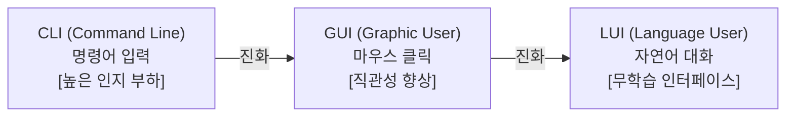

# 📈 [Research 01] LUI의 도래와 에이전트의 도구 사용 패러다임

> **"사용자는 에디터나 툴의 사용법을 잊고, 에이전트는 기계어와 API를 집어삼킨다. 대화가 유일한 소통 수단이 되는 시대의 시작."**

* **연구 작성일**: 2026-05-22
* **주제**: 자연어 인터페이스(LUI)와 자율적 도구 제어(Tool Calling)의 결합이 만드는 인간-에이전트 협업의 실체

---

## 1. 인터페이스의 진화 흐름: CLI에서 LUI로

인간이 컴퓨터와 소통하는 양식(Interface)은 인지 부하를 줄이고 직관성을 높이는 방향으로 발전해 왔습니다.



* **CLI (Command Line Interface)**: 컴퓨터가 이해하는 텍스트 명령어를 인간이 암기하여 타이핑해야 했습니다. (예: `mkdir folder_name`)
* **GUI (Graphical User Interface)**: 폴더 모양 아이콘을 마우스로 클릭하는 시각적 메타포를 도입하여 사용법을 외워야 하는 피로도를 줄였습니다.
* **LUI (Language User Interface)**: 자연어를 인터페이스로 삼음으로써, 시스템의 구체적인 작동 방식이나 메뉴 구조를 전혀 학습하지 않고도 **"나폴리탄 스파게티 레시피를 PDF로 정리해 줘"** 같은 일상적인 소통만으로 원하는 결과를 얻습니다.

---

## 2. 에이전트의 백엔드: 도구 활용 (Tool Calling)

LUI가 프론트엔드라면, 에이전트가 그 아래에서 실제로 작동하여 작업을 완수하게 만드는 원동력은 **도구 사용(Tool Calling)**입니다. 

에이전트는 사용자의 자연어 명령을 분석하여, 스스로 어떤 도구가 필요한지 판단하고 실행합니다.

```
[인간의 입력: "이 데이터를 정렬해서 차트로 보여줘"] 
       │
       ▼ (의도 파악 및 도구 매핑)
🤖 AI 에이전트의 내부 판단:
   1. 데이터 읽기 ──> read_file 툴 실행
   2. 데이터 정렬 ──> Python 스크립트 작성 및 실행
   3. 차트 생성 ──> Matplotlib 라이브러리 구동
   4. 결과 보여주기 ──> 이미지 파일 렌더링 후 대화창 출력
```

* **API 활용**: 날씨 검색, 주가 파악, 이메일 전송 등 외부 API를 활용한 작업 수행.
* **OS & 환경 제어**: 디렉토리 트리 탐색, 파일 생성 및 삭제, 패키지 설치 및 빌드 등 터미널 명령(CLI) 직접 수행.
* **컴퓨터 화면 조작 (Computer Use)**: 사람이 마우스를 클릭하고 타이핑하듯 브라우저를 직접 켜서 웹 서핑을 하거나 사내 인트라넷을 조작.

---

## 3. 핵심 사례 연구 (Case Study)

| 에이전트 기술 | 인터페이스 (인간 관점) | 도구 제어 (에이전트 관점) | 의의 |
| :--- | :--- | :--- | :--- |
| **Claude (Computer Use)** | 채팅 입력 및 실행 화면 뷰 | 가상 OS의 마우스 및 키보드 좌표 직접 클릭/입력 | 인간이 쓰는 모든 데스크톱 앱을 AI가 학습 없이 조작 가능 |
| **OpenAI (Operator / Canvas)** | 문서 편집용 캔버스 창 & 채팅 | 실시간 웹 브라우징, 문서 임베딩 및 인라인 에디팅 | 브라우저상의 대행 업무(예: 항공권 예매, 리서치)의 완전 자동화 |
| **Antigravity (코딩 에이전트)** | 마크다운 계획서 검토 및 대화 | 로컬 파일 생성/수정, 터미널 명령 제안 및 백그라운드 태스크 관리 | 사용자가 코드 한 줄 치지 않고도 로컬 아키텍처 전체를 구축 |

---

## 4. 인간에게 미치는 영향: 우리는 무엇에 집중해야 하는가?

에이전트가 "대화 기능만 남기고 본질에 맞는 도구를 다 뒤에서 조작하는 방식"으로 진화하면서, 인간의 업무와 태도는 근본적인 변화를 맞이합니다.

1. **기술적 장벽의 해체**: 코딩 문법을 몰라도, 포토샵 메뉴를 몰라도 창작과 작업이 가능해집니다.
2. **'어떻게(How)'에서 '무엇을(What)'과 '왜(Why)'로의 전환**: 
   * **과거**: "Next.js에서 라우팅 환경을 어떻게 구축하지?" (How)
   * **미래**: "우리가 만들려는 서비스는 이 사용자의 문제를 해결하려 해. 어떤 라우팅 방식이 우리 서비스의 UX에 가장 적절하고 성능에 유리할까?" (What & Why)
3. **오케스트레이터(Orchestrator)로서의 역량**: 에이전트가 올바른 도구를 선택해 바르게 일하고 있는지 감시하고 조율하는 **디렉팅 능력**이 핵심 경쟁력이 됩니다.

---
*(이 리포트는 WithAi 연구실의 첫 번째 스터디 결과물입니다)*
