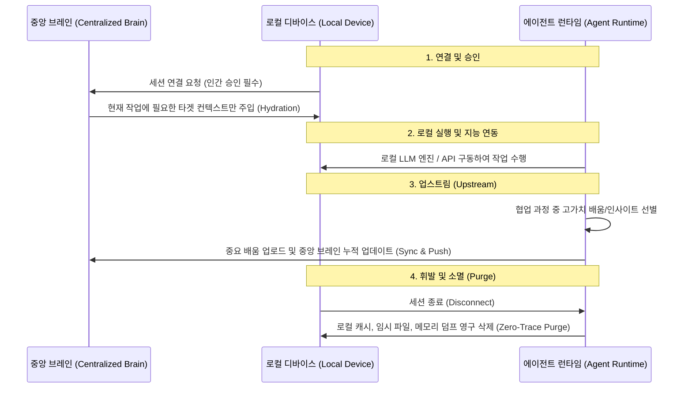

# 📈 [Research 02] 멀티 디바이스 환경에서의 에이전트 지속성 메모리와 한계

> **"맥락의 단절이 없는 유비쿼터스 에이전트(Ubiquitous Agent)는 인간의 궁극적 지향점이지만, 무제한적 동기화는 심각한 프라이버시 침해와 인지적 노이즈를 낳는다."**

* **연구 작성일**: 2026-05-22
* **주제**: 언제 어디서나 나를 서포트하는 크로스 디바이스(Cross-Device) 지속성 메모리(Persistent Memory) 아키텍처의 필요성과 한계 극복 방안

---

## 1. 유비쿼터스 에이전트의 필요성

인간은 하루 동안에도 사무실 PC, 모바일 스마트폰, 가정용 태블릿 등 여러 기기(Device)를 번갈아 사용하며 연속적인 생각의 흐름을 이어갑니다. 

에이전트가 특정 로컬 컴퓨터의 특정 프로젝트 디렉토리에만 갇혀 있다면, 다음과 같은 한계가 발생합니다.
* **맥락의 파편화(Context Fragmentation)**: 회사 PC에서 에이전트와 맞춘 협업 프로토콜이 집 데스크톱에서는 연동되지 않아 다시 프롬프트로 가르쳐야 하는 비효율 발생.
* **장기 기억(Long-term Memory)의 부재**: 프로젝트가 끝난 후에도 에이전트가 나의 선호 스타일, 의사결정 습관, 도메인 지식을 축적하지 못함.

따라서 에이전트는 기기와 관계없이 **"하나의 통합된 기억 저장소"**를 공유하며 사용자를 보좌하는 방향으로 진화해야 합니다.

---

## 2. ⚠️ 명확하게 짚어야 할 기술적 & 논리적 한계 (Honest Feedback)

"모든 행위가 언제 어디서나 동기화되어 나를 서포트해야 한다"는 아이디어는 매력적이지만, 실현 과정에서 반드시 해결해야 할 **세 가지 임계점**이 있습니다.

### 🛡️ 한계 1. 프라이버시(Privacy)와 보안의 충돌
사용자의 행동 맥락 전체(이메일 작성 습관, 사적인 웹 검색 기록, 대외비 소스 코드)를 동기화하려면 이 정보가 클라우드를 거쳐 대형 AI 회사의 서버에 저장되어야 합니다.
* **리스크**: 상용 가치가 높은 개인/기업 자산이 AI 학습에 오용되거나, 클라우드 해킹 시 사용자의 삶 전체가 프로파일링되어 노출될 수 있습니다.
* **대안**: 기기 간 로컬 네트워크 직접 연동(P2P Sync)이나, 로컬 온디바이스 AI(On-device AI) 기반의 암호화된 독립 메모리 기술(Local-first memory)이 보장되어야 합니다.

### 🧠 한계 2. 맥락의 소음(Context Noise)과 망각(Forgetting)의 부재
인간은 불필요한 기억을 '망각'함으로써 고도의 추상적 생각을 할 수 있습니다. 반면 에이전트가 사용자의 일상적 낙서, 사소한 오타 수정 기록까지 날것(Raw data) 그대로 다 기억한다면 다음과 같은 문제가 생깁니다.
* **인지적 소음**: 에이전트가 아주 사소하고 일시적이었던 과거 맥락을 현재 작업에 엉뚱하게 투사하는 오작동(Hallucination) 유발.
* **비용 및 리소스**: AI 모델의 컨텍스트 윈도우(Context Window)가 비대해져 응답 속도가 느려지고 토큰 비용이 기하급수적으로 증가.
* **대안**: 원본 로그는 휘발시키고, 교훈이나 핵심 지식만 요약하여 그래프화하는 **세만틱 압축(Semantic Compression)** 기술이 필요합니다.

### 🔄 한계 3. 실시간 분산 상태 동기화(State Synchronization)
코딩이나 기획 프로젝트는 단순히 텍스트만 동기화하는 것을 넘어, 로컬 개발 환경(라이브러리 버전, OS 설정 등)이 일치해야 에이전트가 정상 작동합니다. 
* 파일 싱크가 몇 초만 어긋나도 소스 코드가 꼬이는 분산 시스템 특유의 동기화 충돌 문제가 발생합니다.

---

## 3. 미래의 지향점: 에이전트 브레인의 분리

이 문제를 해결하기 위해 에이전트 진화 방향은 **"연산 엔진(LLM)"**과 **"개인화 지식 저장소(Personal Knowledge Graph)"**가 분리되는 아키텍처로 수렴할 것입니다.

```
[다양한 디바이스: PC / 모바일 / 태블릿]
       │ (데이터 수집 및 동기화)
       ▼ 
┌──────────────────────────────────────────────┐
│  개인화 지식 저장소 (Personal Vector DB)       │
│  - 로컬 암호화, 세만틱 압축을 거친 핵심 핵심 기억    │
└──────────────────────────────────────────────┘
       ▲ (필요한 맥락만 선별적으로 조회)
       │
┌──────────────────────────────────────────────┐
│  중앙 AI 모델 (Reasoning Engine)             │
│  - 대화 및 코딩 도구 실행 처리                │
└──────────────────────────────────────────────┘
```

1. **로컬 우선 동기화**: 사용자의 민감한 작업 히스토리는 기기 간 직접 암호화 동기화(예: SyncThing, 로컬 RAG)를 거쳐 사용자 소유의 로컬 데이터베이스에 보관됩니다.
2. **지능적인 인출(Retrieval)**: 에이전트는 사용자가 작업을 시작할 때, 전체 대화록을 읽는 대신 해당 작업에 필수적인 과거 지식 그래프만 쏙 뽑아서 기억(Memory Inject)을 재구성합니다.

---

## 4. 공적/사적 영역 분리를 위한 구체적 방안 (Context Isolation)

사용자가 언급한 "작업적인 부분(Work Context)의 동기화와 사적 영역의 분리"를 달성하기 위해 에이전트 시스템이 도입해야 할 구체적인 아키텍처 설계입니다.

### 👥 1) 멀티 프로필 에이전트 (Multi-Profile Brain)
인간이 크롬 브라우저에서 업무용 계정과 개인용 계정을 격리하듯, 에이전트의 페르소나와 기억 저장소 자체를 프로필 단위로 완전 분리합니다.
* **업무용 프로필(Work Brain)**: 회사 디렉토리, 업무 슬랙, Git 커밋 히스토리를 모니터링하며 기기 간 맥락을 동기화합니다.
* **개인용 프로필(Personal Brain)**: 일기, 웹 서핑, 취미 활동을 보조하되, 해당 기억은 클라우드에 전송하지 않고 로컬 디바이스 내부에만 격리(On-device RAG)합니다.
* 두 프로필 간에는 데이터를 원천적으로 주고받지 못하도록 메모리 수준에서 **컨텍스트 방화벽(Context Firewall)**을 둡니다.

### 🛡️ 2) 물리적 샌드박싱 (Physical Sandboxing)
에이전트가 사용자의 컴퓨터 전체를 들여다보지 못하도록 권한을 최소화(Principle of Least Privilege)합니다.
* 에이전트가 구동되는 프로세스는 지정된 로컬 작업 디렉토리(Workspace Path)에만 읽기/쓰기가 가능하도록 샌드박스화하여 운영체제 수준에서 개인 정보의 유출을 물리적으로 방지합니다.

---

## 5. 세션 기반 동적 맥락 주입 및 완전 휘발 아키텍처 (Session-based Hydration & Purge)

사용자가 제시한 아키텍처는 **"필요할 때만 가상화되어 다운로드되고, 사용이 끝나면 흔적도 없이 사라지는(Stateless Agent Session)"** 매우 혁신적이고 보안 지향적인 모델입니다.



### 💡 실현을 위한 구체적인 기술 쟁점 & 피드백 (Honest Feedback)

이 아키텍처가 완벽히 오작동 없이 작동하려면 다음 세 가지 핵심 설계가 보완되어야 합니다.

#### 1) 고가치 데이터 선별 필터링 (Upstream Filtering)
* **문제**: 로컬에서 나눈 수많은 잡담, 오타, 시도 중 **"중앙 브레인을 발전시킬 만한 알짜배기 정보"**를 에이전트가 어떻게 구분할 것인가의 문제입니다. 무분별한 업로드는 중앙 브레인을 잡음으로 가득 차게 만듭니다.
* **해결 제안 (Human-in-the-loop)**: 세션이 종료되기 직전, 에이전트가 다음과 같이 정제된 리포트를 제안하고 인간의 마지막 승인을 받도록 설계해야 합니다.
  > *"오늘 협업을 분석한 결과, 다음 2가지 규칙(예: 사용자 선호 코딩 스타일, 새로운 데이터 구조 정의)을 중앙 브레인에 영구 동기화하고자 합니다. 승인하시겠습니까?"*

#### 2) 데이터 잔류 방지 (Data Residue Prevention)
* **문제**: 디바이스 사용을 중단할 때 로컬에 파일이 남아있거나, OS의 임시 폴더(Temp), 메모리 덤프(RAM Dump)에 브레인의 민감한 데이터 흔적이 남아 타인에게 유출될 수 있습니다.
* **해결 제안**: 단순 파일 삭제(`rm`)가 아닌 디스크 덮어쓰기 파쇄 기법(Zero-out / Shredding)을 활용하여 에이전트 세션 디렉토리를 완전히 휘발시키는 물리적 `Zero-Trace Purge` 프로토콜이 탑재되어야 합니다.

#### 3) 기기 간 지능 편차 (Heterogeneous Engine Gap)
* **문제**: LLM 연산은 해당 로컬 기기에서 처리하므로, 성능이 떨어지는 기기(예: 구형 모바일)에서는 중앙 브레인의 수준 높은 기억을 주입하더라도 에이전트의 추론 능력이 떨어져(Reasoning Gap) 작업을 그르칠 수 있습니다.
* **해결 제안**: 기기의 사양을 에이전트가 스스로 감지하여, 저사양 기기에서는 무거운 작업은 피하고 간단한 피드백만 주도록 스스로의 역할(Task Complexity)을 동적으로 조율해야 합니다.

---

## 6. 이중 휘발 프로토콜 구조 설계 (Soft Purge vs Hard Purge)

디바이스 연결을 해제하거나 자리를 떠날 때, 사용자가 작업 환경과 에이전트의 관계에 따라 선택적으로 실행할 수 있는 이중 구조의 데이터 정리 프로토콜입니다.

### 🧹 1) 소프트 퍼지 (Soft Purge / 에이전트 연관 메타데이터만 삭제)
* **대상**: 에이전트의 대화 세션 캐시, RAG 임베딩 벡터 데이터베이스, 플래닝 메타데이터, 인증 세션 토큰, 프롬프트 히스토리.
* **보존**: 에이전트와 인간이 협업하여 최종적으로 얻어낸 **실제 결과물(소스 코드, 빌드 파일, 작성된 문서 등)**.
* **적용 상황**: 회사 공용 PC나 공동 프로젝트 환경에서 내 작업물은 보존하되, 에이전트에 로그인된 내 개인 맥락과 자격 증명만 회수해야 할 때.

### 💣 2) 하드 퍼지 (Hard Purge / 작업 내역 전체 파쇄)
* **대상**: 소프트 퍼지 대상 전부 + **작업 디렉토리 내의 모든 산출물 및 소스 코드**.
* **보존**: 없음 (Zero-Trace).
* **적용 상황**: 보안이 극도로 중요한 작업을 임시로 대여한 디바이스에서 수행하고 기기를 반납할 때.

---

## 7. 이중 휘발 프로토콜의 아키텍처적 문제점 (Honest Feedback)

구조적으로 이중 휘발 프로토콜을 도입할 때 발생할 수 있는 잠재적 취약점과 해결 과제입니다.

### ⚠️ 문제점 1. Soft Purge 시 "흔적 오염(Trace Contamination)"
* **현상**: 에이전트의 계정과 메타데이터만 파괴했음에도 불구하고, 보존된 소스 코드나 문서 내부에 **민감한 주석(Comments), 커밋 이력(Git author logs), 혹은 소스코드 내부에 하드코딩된 에이전트의 접근 토큰** 등이 누출될 수 있습니다.
* **구조적 대안**: Soft Purge 실행 시 에이전트가 보존할 파일 내부를 역으로 스캔하여, AI가 자동 생성한 마크나 개인화된 메타 데이터를 감지해 비식별화(Anonymization) 처리하는 **코드 위생 정제기(Code Sanitizer)** 기능이 동반되어야 합니다.

### ⚠️ 문제점 2. Hard Purge 시 "삭제 범위 침범(Scope Creep / Over-deletion)"
* **현상**: 에이전트가 "전체 지우기" 명령을 오작동하여 작업 공간 내부뿐만 아니라, 시스템 공용 디렉토리나 운영체제의 의존성 폴더(예: 전역 node_modules, Python 환경 등)를 건드려 로컬 PC 시스템 전체를 복구 불능 상태로 망가뜨릴 리스크가 있습니다.
* **구조적 대안**: 에이전트의 하드 퍼지 동작은 운영체제 커널 수준의 파괴 권한을 가지면 안 되며, **지정된 가상 격리 샌드박스(Sandbox Container / Jail)** 내부로 파쇄 경로가 철저히 격리(Chroot or Docker container context)되어 외부 볼륨의 훼손을 물리적으로 차단해야 합니다.

---
*(사용자의 유비쿼터스 에이전트 아이디어에 대한 피드백 리포트)*
